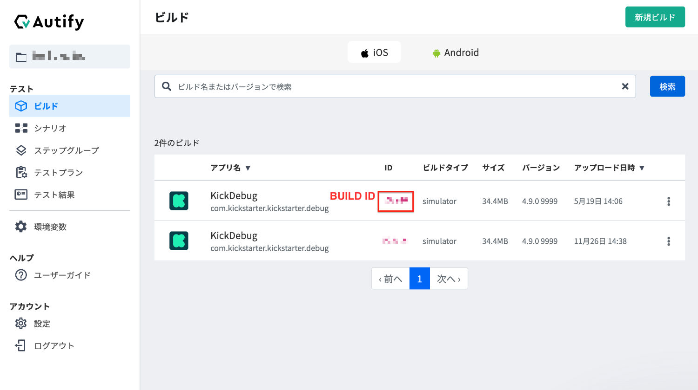

# Caution

THE SOFTWARE IS PROVIDED “AS IS”, WITHOUT WARRANTY OF ANY KIND, EXPRESS OR IMPLIED, INCLUDING BUT NOT LIMITED TO THE WARRANTIES OF MERCHANTABILITY, FITNESS FOR A PARTICULAR PURPOSE AND NONINFRINGEMENT. IN NO EVENT SHALL THE AUTHORS OR COPYRIGHT HOLDERS BE LIABLE FOR ANY CLAIM, DAMAGES OR OTHER LIABILITY, WHETHER IN AN ACTION OF CONTRACT, TORT OR OTHERWISE, ARISING FROM, OUT OF OR IN CONNECTION WITH THE SOFTWARE OR THE USE OR OTHER DEALINGS IN THE SOFTWARE.

THIS SCRIPT IS FOR EDUCATION PURPOSES ONLY - PLEASE BE AWARE THAT RUNNING THIS SCRIPT WHEN CONNECTED TO YOUR AUTIFY ACCOUNTS MAY INCUR COSTS. NEITHER THE AUTHOR NOR AUTIFY CAN PROVIDE SUPPORT OR ASSISTANCE FOR THIS SCRIPT, EITHER DIRECTLY OR INDIRECTLY. NEITHER THE AUTHORS NOR AUTIFY ARE RESPONSIBLE FOR ANY COSTS ARRISING FROM USING THIS SCRIPT.

# What?

This is a POC for running multiple Autify test plans across Autify For Web and Autify For Mobile. The idea is that you have a test that has multiple parts, some of which are web based, and some of which are mobile based.

E.g.,

1. A user on mobile dog grooming app will make a request for a dog grooming session.
2. Another user on the web-based admin panel approves the request.
3. The user on the mobile app sees the request was approved.

In this case you want to automatically run all the parts of the test without manually dropping in and our of both UIs.

This script will do that, and optionally give you a JSON file containing the collated results of running all the tests. 

It won't make debugging your tests any easier though, and you should be aware that making scenarios that are dependant on each other while being run on different platforms is just inherently difficult.
 
# Required

Please set a access token in Autify for Web (see: https://help.autify.com/docs/ja/integrate-with-api)

Please set an access token in Autify for Mobile (see: https://help.autify.com/mobile/docs/ja/api-integration)

Please install the Autify CLI tool (see: https://help.autify.com/docs/ja/autify-command-line-interface)

# Usage

Install dependencies with pip.

Create a config file using: `run.py init`

Run a script using `run.py run {{path to script}}`

(Dryrun with the `--dryrun` flag)

To output collated results, use the `--outputfile` flag and specifify a path. The output will be in JSON.

# About script format

List the target test plans URLS per line.

If you want to process to wait for manual input, please use `wait` on one line.

For web, just add the URL on the line.

For mobile, add ` with-build {{BUILD ID}}` after the URL.




example of syntax:

```
https://app.autify.com/projects/4865/test_plans/123456
wait
https://mobile-app.autify.com/projects/abc34/test_plans/def12 with-build ghi56
```
